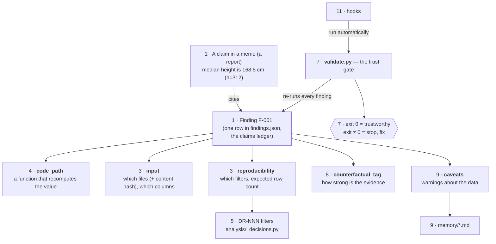
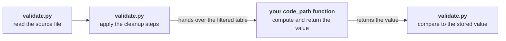
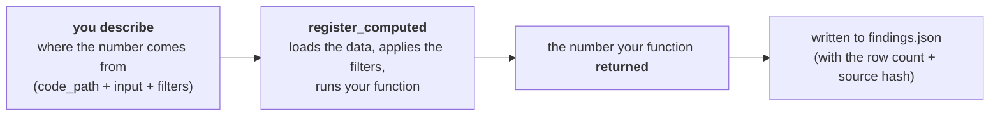
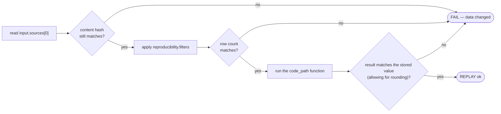
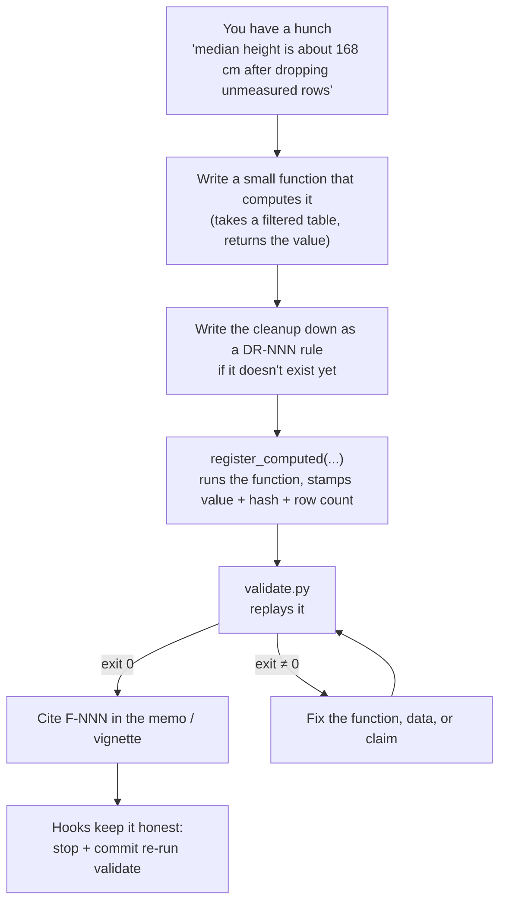
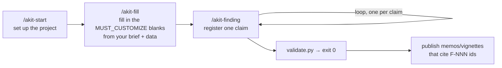

# Concepts — how analysis-kit fits together

This is the mental-model map: the main pieces, in plain language, and how they
relate. Read it before the [USER_GUIDE](USER_GUIDE.md) (the detailed tour) or the
[PROVENANCE_CONTRACT](PROVENANCE_CONTRACT.md) (the exact schema).

## The one idea

**Every number you put in a report is backed by code a computer can re-run.**

When an AI helps analyse data, it writes smoothly and confidently — and that's the
danger. A wrong number that *looks* reasonable reads exactly like a right one. So
analysis-kit never takes a number on trust. Each one is saved together with the
code that produced it, and a checker program — `validate.py` — re-runs that code to
confirm the number still comes out the same. **What you trust is whether
`validate.py` passes, not the words around the number.**

Here's the idea in one analogy. Like double-entry bookkeeping — where every amount
is written down twice and the two copies have to match — each number lives in two
places: once as you wrote it in a *memo* (any report, slide, or message you hand to
a reader), and once as a small piece of code that recomputes it. `validate.py` is
the thing that checks the two agree.

## The cast, in one picture



Each box is tagged with the **number of the section below that explains it** — so
you can read the map here, then jump to the write-up for any piece. (Boxes that
share a number, like `input`/`reproducibility` at section 3, are explained
together.) Everything below is just these boxes, one at a time.

## 1. The finding — the unit of trust

A **finding** is one checked claim. It lives in `analysis/output/findings.json`
(the *claims ledger* — the list of every finding) and has a permanent id, `F-001`,
that you point to everywhere you mention the number: reports, slides, messages,
chats. If a number doesn't have an `F-NNN` behind it, it isn't a claim yet; it's a
vibe.

Anatomy of one finding:

```
F-001  ◀── id; cite this everywhere
├─ claim              "median height is 168.5 cm (n=312)"   ◀── the words a human reads
├─ check_type         scalar                                ◀── what kind of value (how to compare)
├─ code_path          analysis/02_profile.py:median_height  ◀── the function that recomputes it
├─ value              168.5                                 ◀── the number itself
├─ input                                                    ◀── WHAT the claim is about (before compute)
│  ├─ sources   [{ path: …/measurements.csv, sha256: 9f86d08… }]
│  └─ columns   [ height_cm ]
├─ reproducibility                                          ◀── HOW to recompute it (after the data loads)
│  ├─ filters   [ DR-001, DR-003 ]
│  └─ row_count_after_filter   312
├─ counterfactual_tag OBSERVED  (+ measurement_ref)         ◀── how strong is the evidence
├─ caveats            [ zero_sentinel_masked ]              ◀── warnings (point into memory/)
└─ revision_history   [ … ]                                 ◀── the history of edits, never deleted
```

You don't write this out by hand — a helper does it for you (see section 6).

## 2. check_type — the kind of claim

A claim isn't always a single number, so each finding says what *kind* of value it
is. That's how the checker knows what "matches" should mean.

| check_type | The claim is… | Example |
|---|---|---|
| `scalar` | a single number | a median, a count |
| `proportion` | a fraction between 0 and 1 | "32% of users" |
| `rate` | a rate (per unit) | "4.9 sessions per user" |
| `boolean` | a yes/no fact | "the column has missing values" |
| `distribution` | a set of summary numbers | smallest / median / largest, etc. |
| `matrix` | a grid of numbers | a correlation grid |
| `quote_provenance` | an exact quote appears in a source | a reader's exact words |
| `manual` | something that isn't one number | a messy or descriptive finding |

The first six are **replayed** — re-run and compared. `quote_provenance` is checked
by finding the quote in the source file. `manual` is the honest escape hatch: it's
recorded and checked for the right shape, but clearly marked as *not
automatically verified*.

## 3. input vs reproducibility — what data a claim uses, and how

A finding describes where its data comes from in two parts, because those are
really two questions asked at two different moments:

- **`input`** — *what is this claim about?* The source file(s) — each fixed to a
  *content hash* (a short fingerprint of the file's exact contents) — and the
  columns used. Recorded **before** anything is computed.
- **`reproducibility`** — *how do I recompute the number?* The cleanup steps to
  apply, and how many rows should be left afterward. Checked **after**.

Splitting them is what lets the checker tell two very different problems apart:
"the input data changed" (an `input` problem) versus "the cleanup logic changed"
(a `reproducibility` problem). A finding the computer can re-run uses exactly
**one** source file. If a claim really needs several files combined, it's a
`manual` finding — because how to combine them depends on the project, and the
checker can't guess that.

## 4. The function (`code_path`) — just the math

`code_path` points at a function like `analysis/02_profile.py:median_height`. The
rule that makes the whole thing work: **the function is handed a table of data
that has *already* been filtered, and it just returns the value.** (That table is a
"DataFrame" — think rows and columns, like a spreadsheet.) The function does *not*
open the source file or do its own filtering — `validate.py` handles that part,
using `input` and `reproducibility`.



`validate.py` does everything except the middle box — reading the data, cleaning
it, and checking the answer. Your function just receives a ready-to-use table and
returns one number.

Why the split? If the function did its own filtering, someone could change a
cleanup rule and the function would still return the same answer — and the change
would slip by unnoticed. By keeping *which data* separate from *what to compute*, a
change on either side shows up.

## 5. Decisions (DR-NNN) — cleanup as named, reusable rules

Real data needs cleaning — blank out a `0` that really means "not measured", drop
test accounts, exclude half-filled rows. Each cleanup rule is a **decision** with
an id like `DR-001`: written down in plain language in `live-docs/DECISIONS.md`,
and written as a small function `DR_001(df)` in `analysis/_decisions.py`. A finding
lists the `DR-NNN` ids it relies on in `reproducibility.filters`, and `validate.py`
applies them in order before recomputing. One rule, defined once, reused by every
finding that needs it.

## 6. Writing findings — `register_computed`

You never edit `findings.json` by hand. You add findings by running a small Python
script, so the history of changes and the automatic checks stay correct. The
helper you'll reach for almost every time is **`register_computed`**.

**The problem it solves.** The obvious way to record a finding would be: work out
the number (in a notebook, in your head), then write it into the finding. But now
the *same number lives in two places* — your code and the finding — and they can
drift apart, or a typo (or a bit of wishful rounding) can record a number the code
never actually produced. Preventing exactly that is the whole point of the kit.

So `register_computed` doesn't let you hand it a number. You tell it **where the
number comes from**, and it produces the number itself:

```python
from analysis._findings import register_computed, next_id

register_computed(
    id=next_id(),
    claim="median height is 168.5 cm (n=312)",
    check_type="scalar",
    code_path="analysis/02_profile.py:median_height",          # the function to run
    input={
        "sources": [{"path": "reference/raw-data/measurements.csv"}],  # sha256 filled in for you
        "columns": ["height_cm"],
    },
    reproducibility={"filters": ["DR-001"]},                   # row count filled in for you
    caveats=["zero_sentinel_masked"],
    counterfactual_tag="OBSERVED",
    measurement_ref="analysis/02_profile.py:median_height",
)
```

Notice the three things you did **not** write: `value`, the source's `sha256`, and
`row_count_after_filter`. The helper fills those in by actually running the work:

1. loads the source file,
2. applies the `DR-NNN` filters in order,
3. runs your `code_path` function on the filtered data,
4. stores **the value the function returned** — not one you typed,
5. records the real post-filter row count and each source's content hash,
6. validates the finished finding and writes it to `findings.json`.



This is the **execution-primary** guarantee: the stored number is, by definition,
whatever the code produced. You can't mistype it, and you can't quietly record a
nicer-looking number that the code doesn't actually compute. (The `claim` text —
the words "median height is 168.5 cm" — is still something you write for people to
read; it's `value`, the computed number, that `validate.py` actually re-checks.)

**When you'd use plain `register` instead.** `register` is the lower-level form
where you *do* pass the value yourself. You need it only for the two check_types
that have no single number to recompute: `quote_provenance` (you supply the exact
quote) and `manual` (the value is too messy to recompute, so it's checked by hand).

## 7. validate.py — the trust gate

One command decides whether the project is ready to share. It runs in two modes:

- **`--fast`** (about 1 second) — quick checks on the findings file only: every
  finding has the fields it needs, ids are unique, tags are valid, and nothing
  points at a file or function that's missing. It never opens the data.
- **full** (the default) — everything `--fast` does, then **re-runs every
  finding**.

Replay, per finding:



Passing (programs signal success with an "exit code" of `0`) means every claim
recomputed correctly. Anything else means **stop and fix** — don't share it yet.

**What re-running proves, and what it doesn't.** It proves the number is *stable*:
it still comes out the same from the stated data and code, so nothing has quietly
changed underneath it. It does **not** prove the number is *right* — if you aimed a
finding at the wrong column, or the wrong group of rows, re-running will happily
confirm the wrong number. Guarding that gap is the job of the evidence tag
(`counterfactual_tag`, section 8) and a human reviewer.

## 8. The evidence tag (`counterfactual_tag`) — how solid is this claim

Not every claim is equally solid, so each finding is tagged with how strong its
evidence is:

- **`OBSERVED`** — measured straight from the data. Must include a
  `measurement_ref` — a pointer to the code that measured it.
- **`PLAUSIBLE`** — an informed estimate, not measured directly, but with a
  *named* piece of support (a specific code change, another finding, a log entry).
- **`WEAK`** — basically a guess. This tag exists so shaky claims get *labelled*
  instead of quietly passing as solid ones. Never publish a `WEAK` claim.

`validate.py` requires a `measurement_ref` on every `OBSERVED` finding, and warns
if *too many* findings are marked `OBSERVED` (a sign the labelling has gotten
sloppy). See [COUNTERFACTUAL_TAGGING.md](COUNTERFACTUAL_TAGGING.md).

## 9. Caveats and memory — warnings that travel with the claim

A number can be perfectly correct and still misleading — for example, if you
forget that a `0` in the data means "not collected", not "zero". Those gotchas live
in `memory/` (such as `data_quality_caveats.md`), and a finding's `caveats` list
points at the ones that apply to it. The habit: read the relevant memory notes
*before* you compute a summary (an average, a total), and attach them to the
finding, so the warning travels with the claim instead of being forgotten.

## 10. Drift detection — catching change over time

Data gets refreshed; cleanup rules get rewritten. Three independent signals catch
a finding that has quietly stopped being true:

| Signal | What it catches |
|---|---|
| `input.sources[].sha256` (content hash) | the source file's contents changed *at all* |
| `reproducibility.row_count_after_filter` | the number of rows after cleanup moved (e.g. a cleanup rule changed) |
| **schema-lock** (optional) | the *shape* of the data changed even when the row count didn't — a column's type changed, or a value fell outside its allowed range |

The first two happen automatically. The third is optional: you take a snapshot of
the expected layout (`analysis.schemas.snapshot()`, built on the Pandera library),
and the full check compares the data against it.

(When comparing numbers, the check allows a tiny bit of wiggle-room for rounding.
A finding can widen that, but only within a hard cap, and doing so raises a
warning — so the wiggle-room can't be quietly stretched to hide a real change.)

## 11. Hooks — running the checks automatically

A rule that depends on *remembering* to run `validate.py` will eventually be
forgotten. Hooks connect it to Claude Code so it runs on its own. (They're just a
convenience — the real check is `validate.py`; the hooks only make sure it
actually runs.)

| Hook | Runs when… | What it does |
|---|---|---|
| `validate-on-stop` | Claude finishes a turn | Runs the quick check; **stops Claude from finishing** while any finding is failing (it nudges once, then lets go, so it can't get stuck in a loop) |
| `block-unvalidated-commit` | Claude runs `git commit` | Runs the full check; **blocks the commit** if anything fails. If it can't run at all, it blocks rather than letting the commit through |
| `findings-coverage-on-edit` | Claude edits an analysis script | **Reminds** Claude to re-check and keep the findings up to date (just a nudge — never blocks) |

See [HOOKS_GUIDE.md](HOOKS_GUIDE.md) for the technical details.

## 12. Live documents — the working narrative

Around the findings ledger sit six markdown files in `live-docs/`, kept current as
the analysis proceeds:

| File | Holds |
|---|---|
| `TRUST_MEMO.md` | what's reliable / noisy / unassessable (cites F-NNN ids) |
| `DATA_PROFILE.md` | a column-by-column descriptive profile |
| `DECISIONS.md` | the DR-NNN cleanup decisions and their rationale |
| `ANALYSIS_BACKLOG.md` | open analytical questions (A-NNN) |
| `TOOLING.md` | tool/library choices (T-NNN) |
| `METHODOLOGY_LOG.md` | the running methodology story, including mistakes caught |

`findings.json` is the part a computer can check; the live-docs are the *human*
story that explains it and ties it together.

## Putting it together — the life of one claim



## The project lifecycle

A whole project moves through a small set of steps (each has a `/akit-*` skill to
guide Claude through it):



A new project comes in two sizes (**tiers**): `--minimum` (the checks, hooks, and
live-docs) and `--full` (also adds the Quarto pipeline for polished, publishable
reports). Either way the project stands on its own — it doesn't need analysis-kit
installed to keep working; the kit is just what created it.

## What it deliberately is *not*

- **Not a pipeline runner** — it doesn't schedule or chain steps together;
  findings recompute on demand. (Use a tool like Snakemake or Kedro for that.)
- **Not a notebook tool** — the analysis is plain scripts. (Use Ploomber for
  notebook-first work.)
- **Not a guarantee that an answer is *right*** — it guarantees the answer is
  *reproducible* and that you've been *honest about how strong the evidence is*. A
  confident answer to the wrong question is the one thing no checker can catch —
  that's still on you and your reviewers.

---

**Where to go next:** [USER_GUIDE.md](USER_GUIDE.md) for the hands-on tour ·
[PROVENANCE_CONTRACT.md](PROVENANCE_CONTRACT.md) for the exact `findings.json`
schema · [PHILOSOPHY.md](PHILOSOPHY.md) for why it's built this way ·
[HOOKS_GUIDE.md](HOOKS_GUIDE.md) and [COUNTERFACTUAL_TAGGING.md](COUNTERFACTUAL_TAGGING.md)
for the two subsystems with the most rules.
