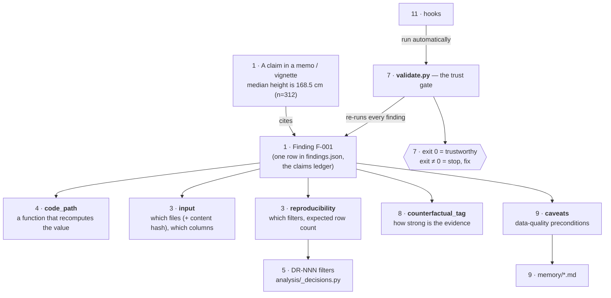
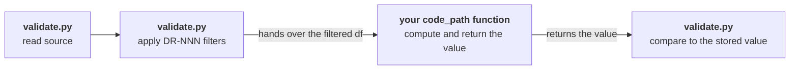
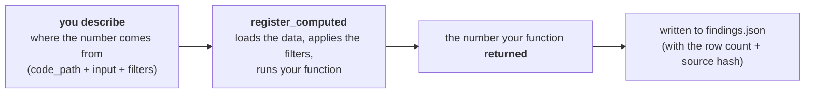
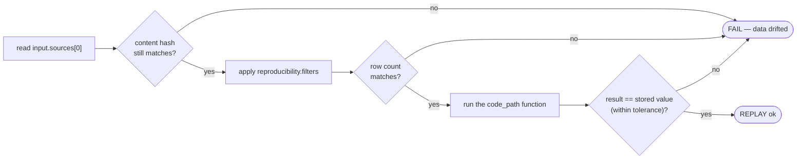
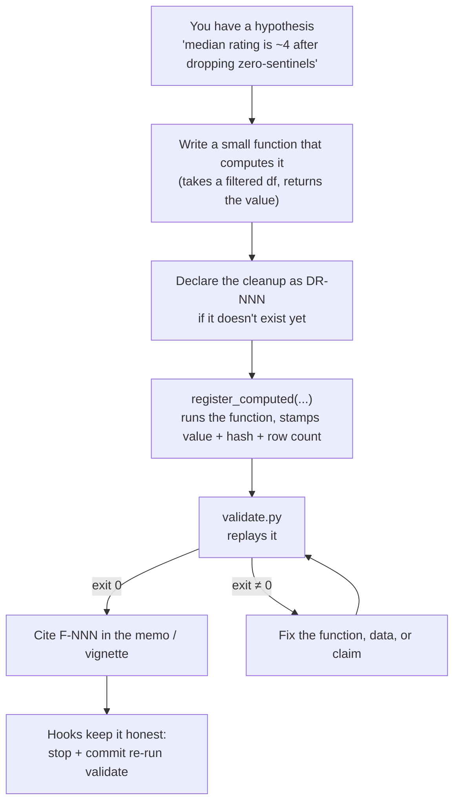
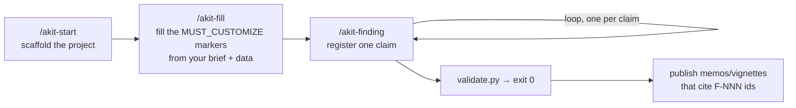

# Concepts — how analysis-kit fits together

This is the mental-model map: the main pieces, in plain language, and how they
relate. Read it before the [USER_GUIDE](USER_GUIDE.md) (the detailed tour) or the
[PROVENANCE_CONTRACT](PROVENANCE_CONTRACT.md) (the exact schema).

## The one idea

**Every number you tell a stakeholder is backed by code a machine can re-run.**

When an AI agent analyses data, it's fluent — and fluency is the problem. A
plausible-looking wrong number reads exactly like a right one. analysis-kit's
answer is to refuse to take any quantitative claim on trust: each one is recorded
with the code that produces it, and a validator re-runs that code and checks the
number still comes out. The **exit code of `validate.py` is the source of truth**,
not the prose around it.

Think of it as **double-entry bookkeeping for analysis**: the number as you write
it in a *memo* (any stakeholder-facing report or message) is one entry, the
re-runnable finding is the other, and `validate.py` checks they agree.

## The cast, in one picture



Each box is tagged with the **number of the section below that explains it** — so
you can read the map here, then jump to the write-up for any piece. (Boxes that
share a number, like `input`/`reproducibility` at section 3, are explained
together.) Everything below is just these boxes, one at a time.

## 1. The finding — the unit of trust

A **finding** is one verified claim. It lives in `analysis/output/findings.json`
(the *claims ledger*) and has a stable id, `F-001`, that you cite everywhere — in
memos, vignettes, PR descriptions, conversations. If a number doesn't have an
`F-NNN` behind it, it isn't a claim yet; it's a vibe.

Anatomy of one finding:

```
F-001  ◀── id; cite this everywhere
├─ claim              "median height is 168.5 cm (n=312)"   ◀── the words a human reads
├─ check_type         scalar                                ◀── what kind of value (how to compare)
├─ code_path          analysis/02_profile.py:median_height  ◀── the function that recomputes it
├─ value              168.5                                 ◀── the number itself
├─ input                                                    ◀── WHAT the claim is about (before compute)
│  ├─ sources   [{ path: …/measurements.csv, sha256: 9f86d08… }]
│  └─ columns   [ height_cm ]
├─ reproducibility                                          ◀── HOW to re-derive it (after compute)
│  ├─ filters   [ DR-001, DR-003 ]
│  └─ row_count_after_filter   312
├─ counterfactual_tag OBSERVED  (+ measurement_ref)         ◀── how strong is the evidence
├─ caveats            [ zero_sentinel_masked ]              ◀── preconditions (point into memory/)
└─ revision_history   [ … ]                                 ◀── append-only audit trail
```

You don't hand-write this JSON — you call a helper (see section 6).

## 2. check_type — the kind of claim

A claim isn't always a single number, so each finding declares its shape. This is
how the validator knows what "matches" means.

| check_type | The claim is… | Example |
|---|---|---|
| `scalar` | a single number | a median, a count |
| `proportion` | a ratio in 0–1 | "32% of sessions" |
| `rate` | a rate | "4.9 sessions per user" |
| `boolean` | a yes/no fact | "a zero-sentinel is present" |
| `distribution` | a set of summary stats | min/median/max/quartiles |
| `matrix` | a 2-D grid | a correlation or confusion matrix |
| `quote_provenance` | a verbatim quote exists in a source | a stakeholder's exact words |
| `manual` | something not auto-checkable | a heterogeneous or qualitative finding |

The first six are **replayed** (re-run and compared). `quote_provenance` is checked
by finding the quote in the source file. `manual` is the honest escape hatch — it's
recorded and structurally checked, but flagged as *not auto-verified*.

## 3. input vs reproducibility — the two halves of a data dependency

A finding splits its data dependency into two blocks, because they answer two
different questions at two different times:

- **`input`** — *what is this claim about?* The source file(s), each pinned with a
  content hash, and the columns used. Asserted **before** any computation.
- **`reproducibility`** — *how do I re-derive the number?* The cleanup filters to
  apply and the row count that should remain. Asserted **after**.

Keeping them separate is what lets the validator tell "the input data changed"
(an `input` problem) apart from "the filtering logic changed" (a `reproducibility`
problem). A replayable finding has exactly **one** source; if a claim genuinely
combines several files, it's a `manual` finding (because how to join them is
project-specific, not something the validator can guess).

## 4. The function (`code_path`) — pure recomputation

`code_path` points at a function like `analysis/02_profile.py:median_height`. The
rule that makes the whole thing work: **the function takes an already-filtered
DataFrame and returns the value.** It does *not* read the source file or apply its
own filters — the validator does that part, using `input` and `reproducibility`.



`validate.py` owns everything except the middle box — reading the data, filtering
it, and checking the answer. Your function just receives a clean DataFrame and
returns a number.

Why the split? If the function applied its own filters, you could change a filter
rule and the function would happily compute the same answer — the drift would be
invisible. By separating *what data* from *what computation*, a change to either
side shows up.

## 5. Decisions (DR-NNN) — cleanup as named, reusable rules

Real data needs cleaning (mask a zero-sentinel, drop test accounts, exclude
incomplete rows). Each cleanup rule is a **decision** with an id like `DR-001`:
documented in `live-docs/DECISIONS.md` and implemented as a function `DR_001(df)`
in `analysis/_decisions.py`. A finding lists the DR-NNN ids it depends on in
`reproducibility.filters`, and the validator applies them in order before
recomputing. One rule, defined once, reused across every finding that needs it.

## 6. Writing findings — `register_computed`

You never edit `findings.json` by hand. You add findings from a small Python
script, so the audit trail and the cross-checks stay correct. The helper you'll
reach for almost every time is **`register_computed`**.

**The problem it solves.** The obvious way to record a finding would be: work out
the number (in a notebook, in your head), then write it into the finding. But now
the *same number lives in two places* — your code and the finding — and they can
drift apart, or a typo (or a bit of wishful rounding) can record a number the code
never actually produced. Preventing exactly that is the whole point of the kit.

So `register_computed` doesn't let you hand it a number. You tell it **where the
number comes from**, and it produces the number itself:

```python
from analysis._findings import register_computed, next_id

register_computed(
    id=next_id(),
    claim="median height is 168.5 cm (n=312)",
    check_type="scalar",
    code_path="analysis/02_profile.py:median_height",          # the function to run
    input={
        "sources": [{"path": "reference/raw-data/measurements.csv"}],  # sha256 filled in for you
        "columns": ["height_cm"],
    },
    reproducibility={"filters": ["DR-001"]},                   # row count filled in for you
    caveats=["zero_sentinel_masked"],
    counterfactual_tag="OBSERVED",
    measurement_ref="analysis/02_profile.py:median_height",
)
```

Notice the three things you did **not** write: `value`, the source's `sha256`, and
`row_count_after_filter`. The helper fills those in by actually running the work:

1. loads the source file,
2. applies the `DR-NNN` filters in order,
3. runs your `code_path` function on the filtered data,
4. stores **the value the function returned** — not one you typed,
5. records the real post-filter row count and each source's content hash,
6. validates the finished finding and writes it to `findings.json`.



This is the **execution-primary** guarantee: the stored number is, by
construction, whatever the code produced. You can't fat-finger it, and you can't
quietly record a flattering number the code doesn't actually compute. (The `claim`
string — "4.2" — is still prose you write for humans; it's `value`, the computed
number, that the validator re-checks.)

**When you'd use plain `register` instead.** `register` is the lower-level form
where you *do* pass the value yourself. You need it only for the two check_types
that have no single number to recompute: `quote_provenance` (you supply the
verbatim quote) and `manual` (the value is heterogeneous and audited by hand).

## 7. validate.py — the trust gate

One command decides whether the project is shippable. It runs in two modes:

- **`--fast`** (~1s) — structural checks only: ids well-formed and unique, required
  fields and payloads present, `code_path` shaped correctly, tags valid, source
  hashes consistent, no dangling references. No data is read.
- **full** (default) — everything `--fast` does, then **replays every finding**.

Replay, per finding:



`exit 0` means every claim re-derived. Any non-zero exit means **stop and fix** —
do not ship.

**What replay proves, and what it doesn't.** Replay proves *stability*: the number
still re-derives from the declared data and code, so it hasn't silently drifted. It
does **not** prove *correctness* — if you pointed a finding at the wrong column or
cohort, replay will faithfully confirm the wrong number. That boundary is what the
counterfactual tag (section 8) and human review are for.

## 8. Counterfactual tags — honesty about evidence

Not every claim is equally solid. Each finding carries a tag:

- **`OBSERVED`** — measured directly from data. Requires a `measurement_ref` (a
  pointer to the measuring code).
- **`PLAUSIBLE`** — an informed estimate with a *named* supporting pattern (a
  commit, another finding, a log) — not directly measured.
- **`WEAK`** — a guess. A category that exists so soft claims get *marked* instead
  of smuggled in as if they were solid. Never publish a `WEAK` claim.

The validator warns if too many findings are `OBSERVED` (discipline decaying) and
requires the `measurement_ref` on every `OBSERVED` one. See
[COUNTERFACTUAL_TAGGING.md](COUNTERFACTUAL_TAGGING.md).

## 9. Caveats and memory — preconditions that travel

A number can be technically correct and still misleading if you forget that "0"
means "not collected, not zero." Those gotchas live in `memory/` (e.g.
`data_quality_caveats.md`), and a finding's `caveats` list points at the ones that
apply to it. The discipline: read the relevant memory entries *before* computing an
aggregate, and attach them to the finding so the caveat travels with the claim.

## 10. Drift detection — catching change over time

Data refreshes; filters get refactored. Three independent signals catch a finding
that has quietly stopped being true:

| Signal | Catches |
|---|---|
| `input.sources[].sha256` (content hash) | the raw file's bytes changed at all |
| `reproducibility.row_count_after_filter` | the filtered row count moved (e.g. a filter rule subtly changed) |
| **schema-lock** (optional, Pandera) | shape/type/range drift that *conforms* in row count — a column retyped, a value out of range |

The first two are automatic. The third is opt-in: `analysis.schemas.snapshot()`
freezes an expected schema, and full-mode validate re-checks the data against it.

(Numeric comparisons use a small tolerance; a finding may override it, but the
override is **capped and surfaced as a warning** so the trust knob can't be quietly
widened to hide drift.)

## 11. Hooks — making the contract automatic

Discipline that relies on remembering to run `validate.py` decays. Hooks wire it
into Claude Code so it happens on its own. (They're a convenience layer — the
contract is `validate.py`; the hooks just make sure it runs.)

| Hook | Fires when… | What it does |
|---|---|---|
| `validate-on-stop` | Claude finishes a turn | Runs `--fast`; **blocks the turn** while findings are red (with a one-retry loop guard) |
| `block-unvalidated-commit` | Claude runs `git commit` | Runs full replay; **blocks the commit** if anything fails. **Fails closed** — a missing dependency blocks the commit rather than letting it slip |
| `findings-coverage-on-edit` | Claude edits a compute script | **Nudges** Claude to re-validate and keep findings in sync (advisory, never blocks) |

See [HOOKS_GUIDE.md](HOOKS_GUIDE.md) for the exit-code/stream details.

## 12. Live documents — the working narrative

Around the findings ledger sit six markdown files in `live-docs/`, kept current as
the analysis proceeds:

| File | Holds |
|---|---|
| `TRUST_MEMO.md` | what's reliable / noisy / unassessable (cites F-NNN ids) |
| `DATA_PROFILE.md` | a column-by-column descriptive profile |
| `DECISIONS.md` | the DR-NNN cleanup decisions and their rationale |
| `ANALYSIS_BACKLOG.md` | open analytical questions (A-NNN) |
| `TOOLING.md` | tool/library choices (T-NNN) |
| `METHODOLOGY_LOG.md` | the running methodology story, including mistakes caught |

The findings.json is the *machine-checkable* truth; the live-docs are the *human*
narrative that explains and connects it.

## Putting it together — the life of one claim



## The project lifecycle

A whole project moves through a small set of steps (each has a `/akit-*` skill to
guide Claude through it):



A scaffolded project comes in two **tiers**: `--minimum` (the contract, hooks, and
live-docs) and `--full` (adds the Quarto vignette pipeline for publishable
reports). Either way the scaffolded project is **self-contained** — it has no
runtime dependency on analysis-kit; the kit is just the thing that stamped it out.

## What it deliberately is *not*

- **Not a pipeline runner** — no DAG, no orchestration. Findings recompute on
  demand. (Use Snakemake/Kedro for orchestration.)
- **Not a notebook framework** — analysis is plain scripts. (Use Ploomber for
  notebook-first work.)
- **Not a guarantee of correctness** — it guarantees *reproducibility and honesty
  about evidence*. A confidently-computed answer to the wrong question is the one
  thing no validator catches; that's still on you and your reviewers.

---

**Where to go next:** [USER_GUIDE.md](USER_GUIDE.md) for the hands-on tour ·
[PROVENANCE_CONTRACT.md](PROVENANCE_CONTRACT.md) for the exact `findings.json`
schema · [PHILOSOPHY.md](PHILOSOPHY.md) for why it's built this way ·
[HOOKS_GUIDE.md](HOOKS_GUIDE.md) and [COUNTERFACTUAL_TAGGING.md](COUNTERFACTUAL_TAGGING.md)
for the two subsystems with the most rules.
